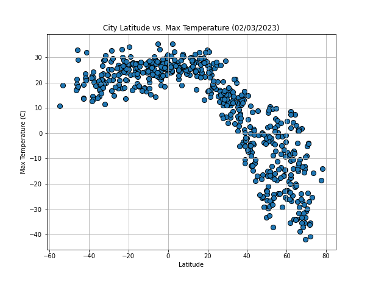
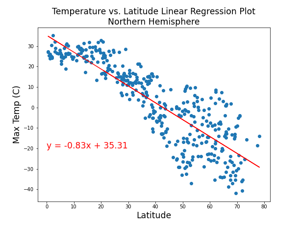
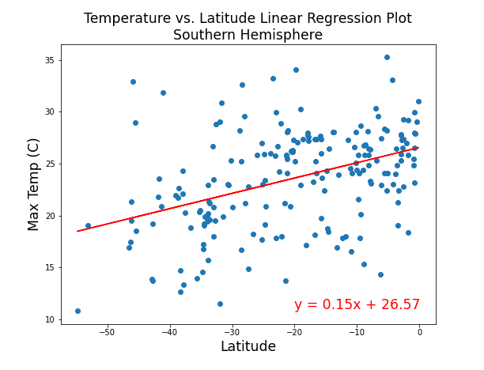
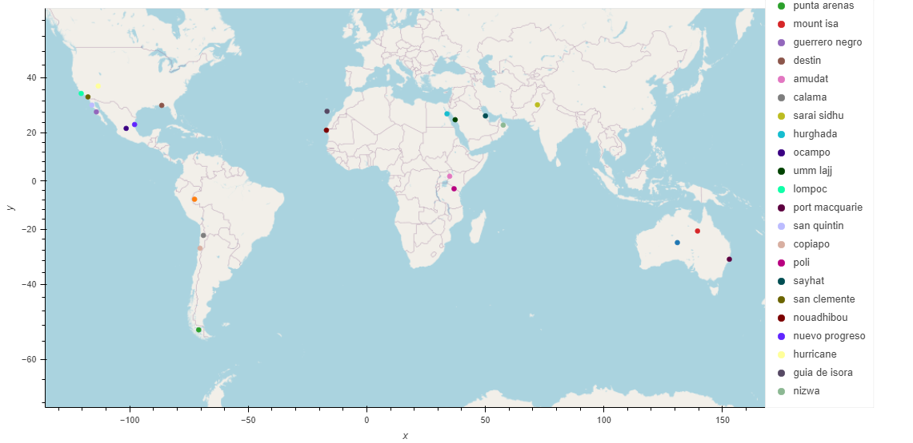

# WeatherPy and VacationPy

As part of my GWU Data Analysis & Visualization Boot Camp, I was tasked with visualizing a weather analysis (WeatherPy) and plotting desired vacation cities on a map (VacationPy).

Technologies used in this project:
* Python
* Jupyter Notebook
* API Request
* Pandas
* NumPy
* SciPy
* Matplotlib
* hvPlot

## WeatherPy

WeatherPy is an analysis of the weather of 581 random cities on 02/03/2023 and their distance from the equator. The random cities are generated using the citypy library and the weather data is gathered using OpenWeatherAPI. The relationships between latitude and max temperature, latitude and humidity, latitude and cloudiness, and latitude are wind speed are visualized using scatter plots. Finally, linear regression plots are used to visualize correlation for the above relationships for cities in the Nothern Hemisphere and cities in the Souther Hemisphere.

This analysis shows that the temperature and distance from the equator are correlated. However, there is a much stronger correlation in the Northern Hemisphere than in the Southern Hemisphere.

## VacationPy

VacationPy filters the cities and their February 3rd weather from WeatherPy based on this author's ideal weather conditions for vacationing, between 15 and 25 degrees Celsius and between 30 and 50 percent humidity. After the 24 cities are identified, the nearest hotel information is gathered using GeoApify API. The cities are mapped using HvPlot and GeoViews with the hotel name presented when hovering over the city marker.

